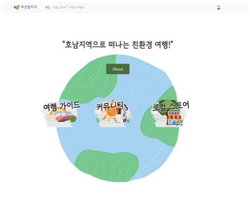
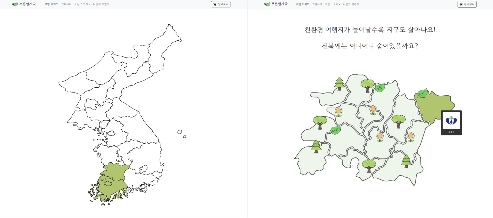
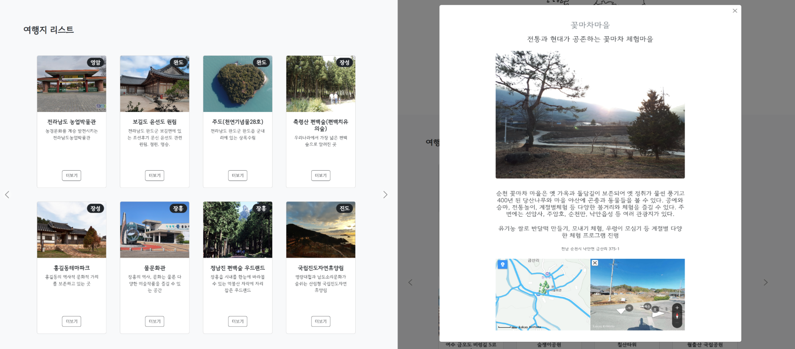
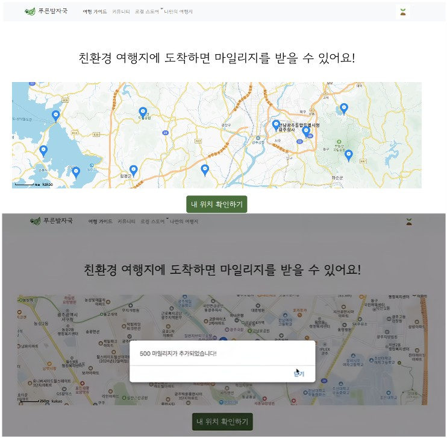
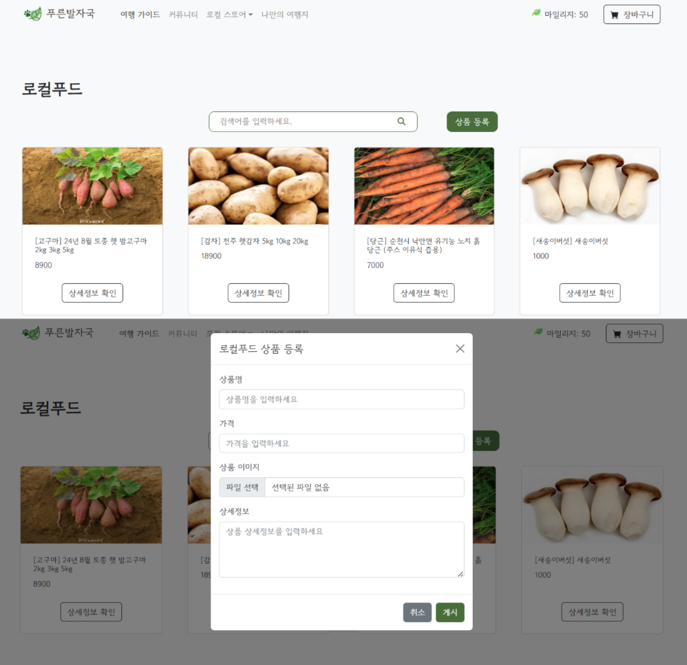
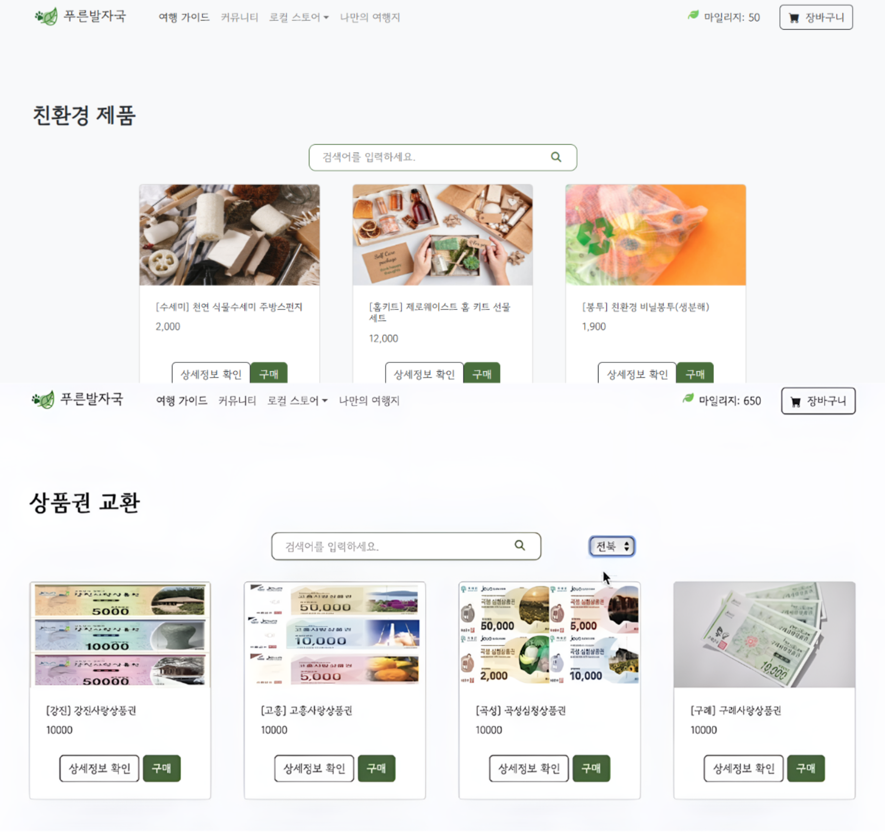

# 푸른발자국

**푸른발자국**은 친환경 여행을 장려하고 지역 관광과 로컬 소비를 연결하기 위해 개발한 웹 애플리케이션입니다.

사용자는 지도에서 호남 지역별로 친환경 여행지를 탐색하고, 여행지별 상세 정보와 위치를 확인할 수 있습니다.

친환경 여행지 방문 시 위치 인증을 통해 마일리지를 획득할 수 있으며, 적립한 마일리지는 친환경 제품 및 지역 상품권 교환에 활용할 수 있습니다.

또한 로컬푸드 상품과 여행 관련 정보를 제공하여 친환경 여행과 지역 경제 활성화를 함께 지원하도록 구성했습니다.

---

## 실행 화면

### 메인 화면



### 여행지 탐색






### 방문 인증 및 마일리지 적립



### 로컬 스토어





---

## 주요 기능

### 🗺️ 친환경 여행지 탐색

- 대한민국 지도 기반 지역 선택
- 호남 지역의 친환경 여행지 목록 제공
- 여행지별 상세 정보 확인
- 지도 및 로드뷰를 활용한 위치 정보 제공

### 📍 방문 인증 및 마일리지 적립

- Kakao Maps JavaScript API를 활용한 위치 표시
- 브라우저 위치 정보를 활용한 현재 위치 인식
- 등록된 친환경 여행지와의 위치 비교를 통한 도착 여부 확인
- 방문 조건 충족 시 마일리지 자동 적립

### 🛍️ 로컬 스토어

- 친환경 제품 목록 조회
- 지역 상품권 목록 및 상세 정보 조회
- 지역별 상품 분류 및 목록 조회
- 마일리지를 활용한 상품 구매 및 교환

### 🥕 로컬푸드

- 지역 농산물 및 특산품 조회
- 상품 상세 정보 확인
- 로컬푸드 상품 등록

### 💬 커뮤니티

- 여행지 및 지역 관광 관련 게시글 조회
- `localStorage`를 활용해 게시글과 댓글을 저장하는 데모 형태로 구성

---

## 기술 스택

- **Frontend**: HTML, CSS, JavaScript
- **Database / Backend Service**: Firebase
- **Map API**: Kakao Maps JavaScript API
- **Version Control**: Git, GitHub

---

## 주요 구현 내용

### SVG 지도 기반 지역 탐색

대한민국 및 호남 지역 SVG 지도에서 지역을 선택하면 해당 지역의 친환경 여행지 목록으로 이동하도록 구현했습니다.

지역별 여행지 데이터는 카드와 모달 형태로 제공하며, 여행지명, 설명, 이미지, 주소 등 상세 정보를 한 화면에서 확인할 수 있도록 구성했습니다.

### Kakao Maps 기반 상세 위치 및 로드뷰

Kakao Maps JavaScript API를 활용하여 여행지 상세 모달에서 지도와 마커를 표시하고, 로드뷰 전환 기능을 구현했습니다.

지도 SDK는 `kakao-map-loader.js`에서 동적으로 로드하도록 분리하여 여러 페이지에서 중복 로딩을 방지하고, API Key를 HTML에 직접 작성하지 않도록 구성했습니다.

### 위치 기반 방문 인증 및 마일리지 적립

브라우저 Geolocation API로 사용자의 현재 위치를 가져오고, 등록된 친환경 여행지 좌표와의 거리를 계산해 방문 여부를 판단하도록 구현했습니다.

허용 반경 안에 사용자가 위치한 경우 Firestore의 사용자 마일리지를 증가시키고, 인증 결과를 화면에 즉시 안내하도록 구성했습니다.

### Firebase 기반 상품 데이터 연동

Firebase Realtime Database를 활용하여 친환경 제품, 지역 상품권, 로컬푸드 상품을 페이지별로 조회하고 화면에 동적으로 렌더링했습니다.

상품 등록 시 Firebase Storage에 이미지를 업로드한 뒤 다운로드 URL과 상품 정보를 함께 저장하도록 구현했습니다.

상품권 페이지에서는 선택한 지역에 따라 Firebase 조회 경로를 변경해 지역별 상품 목록을 표시하고, 상품 구매 시 사용한 마일리지를 사용자 정보에 반영하도록 구성했습니다.

### 외부 데이터의 DOM 기반 렌더링

상품, 게시글, 댓글처럼 사용자 입력이나 외부 데이터가 포함될 수 있는 화면은 `createElement`, `textContent`, `replaceChildren`을 중심으로 렌더링하여 HTML 문자열 직접 삽입을 줄였습니다.

---

## 프로젝트 구조

```text
.
├── assets/          # 이미지, 아이콘, 지도 SVG 등 정적 리소스
├── community/       # 커뮤니티 목록, 작성, 상세, 수정 페이지
├── css/             # 공통 스타일 및 페이지별 스타일
├── js/              # Firebase, Kakao Maps, 상품, 커뮤니티 로직
├── firebase/        # Firebase 보안 규칙 파일
├── mainsite.html    # 메인 페이지
├── tripmain.html    # 여행지 탐색 메인 페이지
├── mapsite.html     # 지도 기반 지역 선택 페이지
├── mileage.html     # 방문 인증 및 마일리지 페이지
├── local_food.html  # 로컬푸드 상품 페이지
├── eco_product.html # 친환경 제품 페이지
├── gift.html        # 지역 상품권 페이지
├── shopping_cart.html
├── mypage.html
├── firebase.json    # Firebase Hosting 설정
└── ...
```